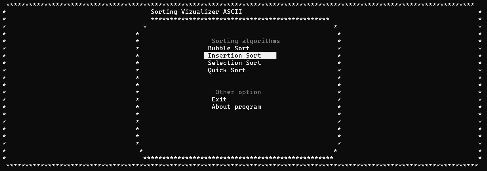
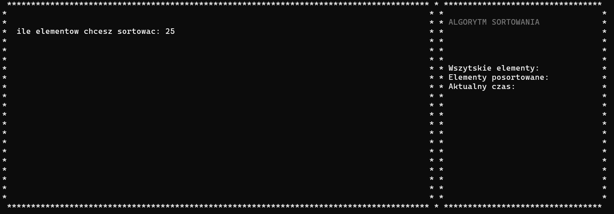
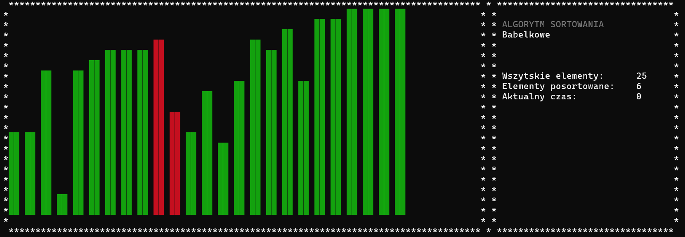

# SortingVizualizer
Sorting simulator wich showing how simple sorting alghoritms works
Program was written in C++ using the WinAPI libraries. It uses Windows libraries such as Windows.h, so the best option to run this program is to download the source code and compile it on a Windows machine. At the moment, I haven't considered deploying it on Linux. Overall, I wrote this program during the fundamentals of algorithmics course for my first-year studies

### How it's looks like
---

main menu, you can choose options using 'W' and 'S' and select option you want by hit 'E' ('m wondering why I didn't program the arrow keys and Enter." :})

Then you can tap the ammount of elements you want to sort (each element is represented by green rectangle)

